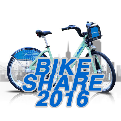
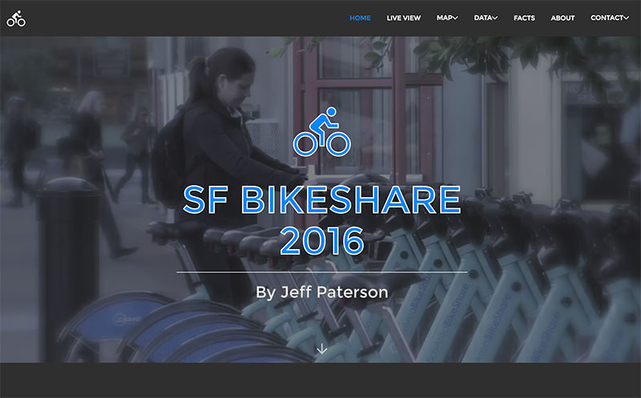
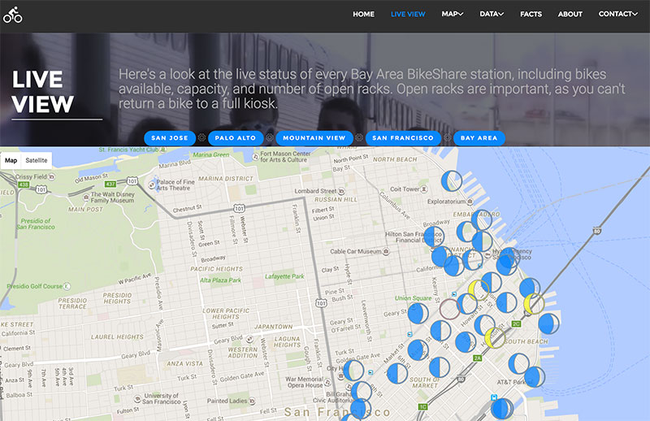
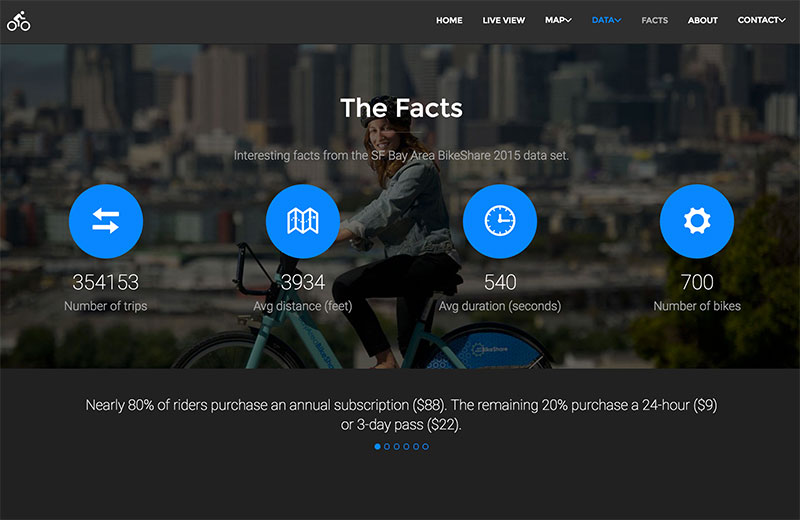

<h2>SF Bay Area BikeShare 2016 app 
by Jeff Paterson
</h2>

Live status of every Bay Area kiosk in the regional BikeShare program, as well as detailed data visualization and analysis of the 2015 BikeShare data set.

Live application: 
<strong>
<a href="http://http://bikeshare2016.herokuapp.com/">http://bikeshare2016.herokuapp.com/</a>
</strong>

BikeShare API overlaid on Goggle Maps API, with data visualizations using D3. jQuery, and extended libraries, are used extensively for visual transitions.

