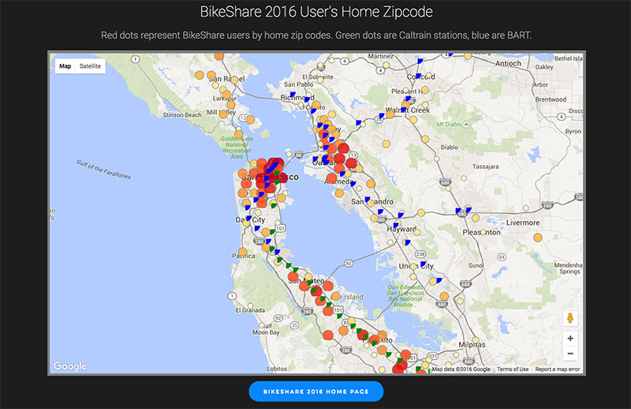
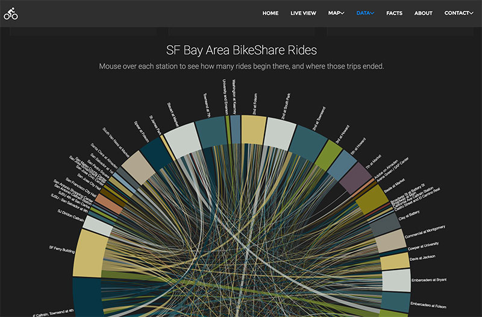

<h2>SF Bay Area BikeShare 2016 app
by Jeff Paterson
</h2>

Live status of every Bay Area kiosk in the regional BikeShare program, as well as detailed data visualization and analysis of the 2015 BikeShare data set.

BikeShare API overlaid on Goggle Maps API, with data visualizations using D3. jQuery, and extended libraries, are used extensively for visual transitions.

